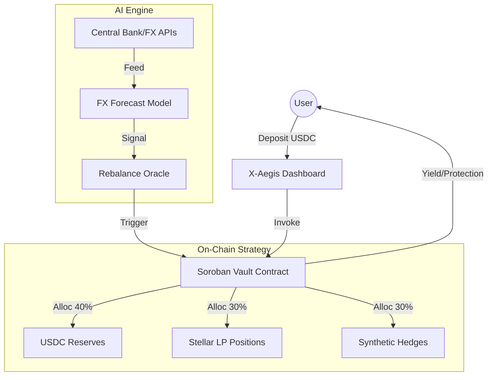

# X-Aegis 🛡️📉


> **A Stablecoin Volatility Shield for Weak Currencies.**

[](LICENSE)
[](https://soroban.stellar.org)

## 💡 The Idea

Even stablecoins expose users in emerging economies (like Nigeria) to FX timing risk, dollar volatility relative to local inflation, and entry/exit rate manipulation. **Stable ≠ Stable relative to local purchasing power.**

**X-Aegis** acts as a "Micro hedge fund for everyday Africans."

-   **User Action:** Users deposit stablecoins.
-   **AI Engine:** Predicts FX volatility and local inflation trends.
-   **Smart Allocation:** Contract automatically allocates funds into:
    -   Stablecoins (Safety)
    -   Synthetic inflation hedges (Growth)
    -   Liquidity pools (Yield)

*This is a rare narrative with a strong technical moat.*

---

## 🏗️ Architecture



---

## 🛠 Tech Stack

**Blockchain:**
*   Soroban asset management contract
*   Yield allocation logic
*   Stellar liquidity integration

**AI:**
*   Time-series FX forecasting
*   Inflation modeling
*   Risk scoring engine

**Data Sources:**
*   Central bank APIs
*   FX feeds
*   Market price feeds

**Frontend:**
*   Portfolio dashboard
*   Risk visualization UI

---

## 🚀 Getting Started

### 1. Prerequisites
*   Node.js v18+
*   Rust & Cargo
*   Freighter Wallet

### 2. Local Setup
(This repo is currently local-only).

> [!IMPORTANT]
> This repository only contains the frontend code. For the smart contracts and AI engine logic, please refer to the [Aegis-contract](https://github.com/ChainLab-X/Aegis-contract) repository.

**Verify Integrity:**
```bash
cargo build --all
```


**Setup Frontend:**
```bash
cd frontend
npm install
# Frontend setup instructions go here
```

---

## 📚 Documentation & Trackers


Guides:
*   🌐 **[Frontend Integration Guide](./docs/FRONTEND_GUIDE.md)**

---

## 🤝 Contributing

See [CONTRIBUTING.md](CONTRIBUTING.md).

---

*Project maintained by @bbkenny.*
