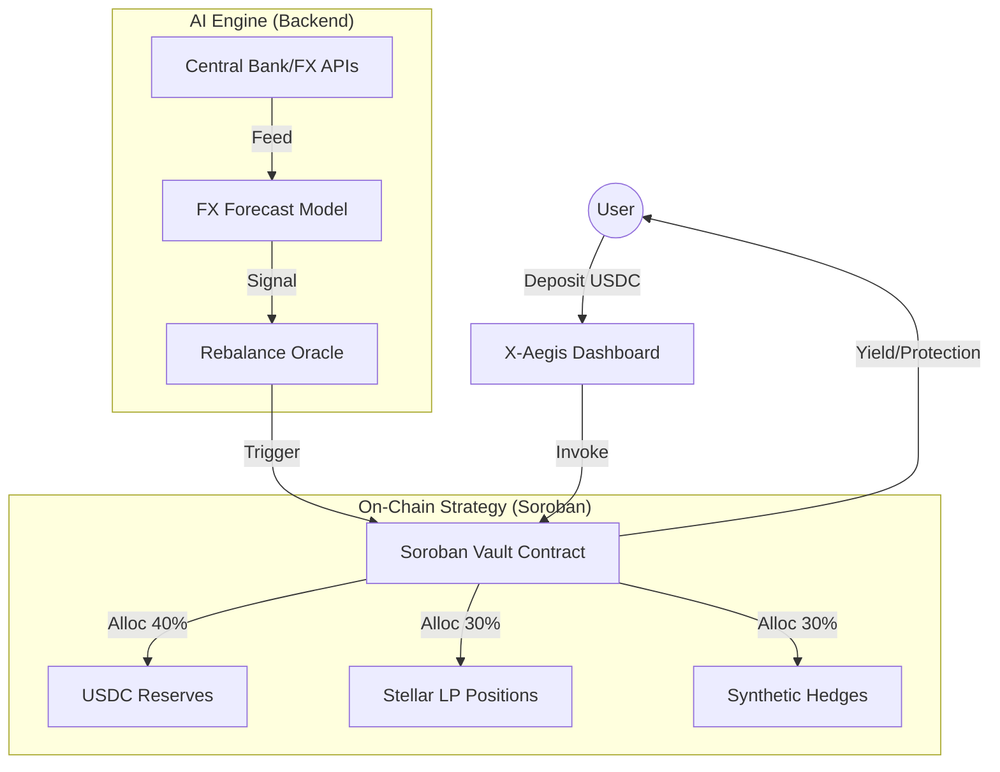

# X-Aegis Frontend & Dashboard 🛡️📊

<p align="center">
  
</p>

```text
╔════════════════════════════════════════════════════════════════════╗
║                                                                    ║
║           X - A E G I S   F R O N T E N D   &   D A P P            ║
║                                                                    ║
║               The Volatility Shield Dashboard                      ║
║           Decentralized Asset Management on Stellar                ║
║                                                                    ║
╚════════════════════════════════════════════════════════════════════╝
```

> **A Stablecoin Volatility Shield for Weak Currencies.**

[](LICENSE)
[](https://soroban.stellar.org)

## 💡 The Idea

Even stablecoins expose users in emerging economies (like Nigeria) to FX timing risk, dollar volatility relative to local inflation, and entry/exit rate manipulation. **Stable ≠ Stable relative to local purchasing power.**

**X-Aegis** acts as a "Micro hedge fund for everyday Africans."

-   **User Action:** Users deposit stablecoins.
-   **AI Engine:** Predicts FX volatility and local inflation trends.
-   **Smart Allocation:** Contract automatically allocates funds into:
    -   Stablecoins (Safety)
    -   Synthetic inflation hedges (Growth)
    -   Liquidity pools (Yield)

*This is a rare narrative with a strong technical moat.*

---

## 🏗️ Architecture



---

## 🛠 Tech Stack

**Blockchain:**
*   Soroban asset management contract
*   Yield allocation logic
*   Stellar liquidity integration

**AI/Backend:**
*   Time-series FX forecasting (Python/FastAPI)
*   Inflation modeling
*   Risk scoring engine

**Data Sources:**
*   Central bank APIs
*   FX feeds
*   Market price feeds

**Frontend:**
*   **Next.js 14**: App Router dashboard
*   **Tailwind CSS**: Institutional styling
*   **Freighter Wallet**: Stellar connectivity
*   **Shadcn/UI**: Data visualization components

---

## 🚀 Getting Started

### 1. Prerequisites
*   Node.js v18+
*   Freighter Wallet extension

### 2. Local Setup

> [!IMPORTANT]
> This repository contains the **Frontend & Integration** logic. For the core protocol contracts, see [Aegis-contract](https://github.com/X-Aegis/Aegis-contract). For the AI forecasting engine, see [aegis-backend-ai](https://github.com/X-Aegis/aegis-backend-ai).

**Setup Dashboard:**
```bash
cd frontend
npm install
npm run dev
```

---

## 📚 Documentation & Trackers

*   🎨 **[Frontend Issues](./docs/ISSUES-FRONTEND.md)**
*   🏛️ **[Smart Contract Issues (External)](https://github.com/X-Aegis/Aegis-contract/issues)** 
*   🤖 **[Backend & AI Roadmap](https://github.com/X-Aegis/aegis-backend-ai/blob/main/docs/BACKEND_ROADMAP.md)**

Guides:
*   📘 **[Frontend Integration Guide](./docs/FRONTEND_GUIDE.md)**
*   🌐 **[Smart Contract Integration](./docs/SMARTCONTRACT_GUIDE.md)**

---

## 🤝 Contributing

See [CONTRIBUTING.md](CONTRIBUTING.md).

---

*Project maintained by @bbkenny.*
